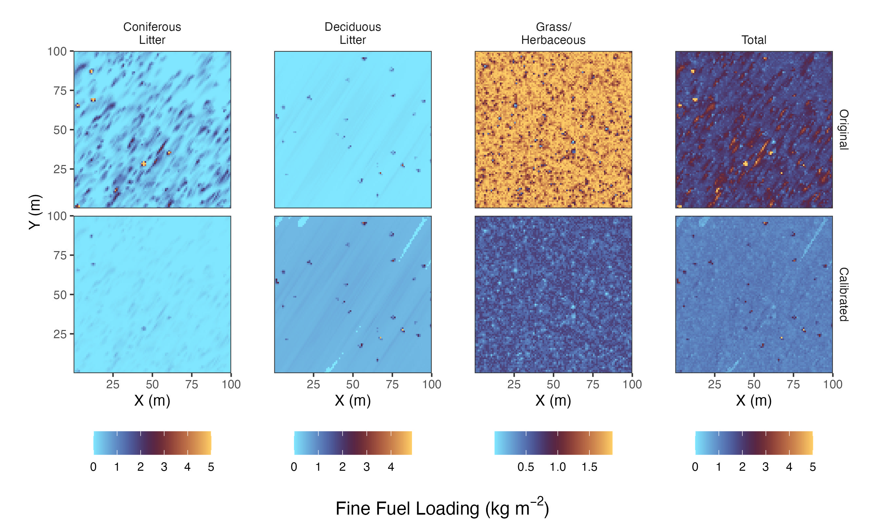

# Summary

Fuel modeling is a key avenue for understanding dynamics of fire-vegetation interactions across landscapes.
Three-dimensional (3D) fuel models are used as inputs for fire behavior models to develop strategies for prescribed fire application and wildfire risk assessment and mitigation.
Distribution of Understory using Elliptical Transport (DUET) is a recently developed program for creating surface fuel inputs for 3D fuel models [@mcdanold_duet_2023].
DUET was developed at the Los Alamos National Laboratory for creating inputs to physics-based 3D fire behavior models like FIRETEC [@linn_studying_2002] and QUIC-Fire [@Linn2020a].
It simulates litter fall from 3D tree canopy inputs and grass growth, producing spatially heterogeneous estimates of fine fuel distribution and characteristics in forested domains.

Users of DUET may wish to parameterize simulations or modify outputs, but to date there are no programmatic tools for interacting with DUET inputs or outputs.
Here we introduce `duet-tools`, a Python package that streamlines the process for creating DUET simulation input files and calibrating the values in DUET output files.
The package handles two primary aspects of the DUET workflow: (1) programmatic creation and management of the DUET input file with validation and documentation, and (2) calibration of fine fuel outputs towards values provided by online data sources or directly from the user.
By simplifying these tasks, `duet-tools` allows modelers and managers to more easily interact with the DUET program while incorporating locally-accurate fuels data.

# Statement of need

Physics-based fire behavior models, such as FIRETEC or QUIC-Fire, take in relatively fine-scale (< 4 m<sup>3</sup>) inputs describing fine fuel density, size, moisture, and height.
In forested landscapes, modeling the distribution of fine fuels on the surface (*e.g.*, leaf litter, herbaceous fuels) is challenging because of their heterogeneity and the difficulty of observing them with survey tools such as airborne LiDAR.
DUET presents a solution by simulating the spatial arrangement of leaf or needle drop based on tree crown dimensions and prevailing wind direction, placing grass where litter levels would not limit its growth.
However, these simulations may not capture some essential elements of understory dynamics that vary geographically, such as decay rates, herbaceous fuel loading, or fuel moisture content.
Thus, users of DUET may wish to modify outputs of the simulations, differentially shifting the magnitudes loading, height, and/or moisture values based on field-measured values, expert opinions, or broad-scale datasets, without altering the spatial distributions predicted by DUET.
However, accomplishing this requires specialized knowledge of DUET outputs and tedious coding workflows.
To date, no standardized tool exists for managing the inputs and outputs of DUET simulations to parameterize realistic, place-based 3D fire behavior simulations.

`duet-tools` addresses these needs by providing:

1. A simple, validated interface for creating, reading, and modifying DUET input files
2. Intuitive programmatic management of idiosyncratic DUET output arrays
3. Built-in functions for differentially calibrating fuel elements within DUET outputs based on targets supplied by the user or queried from online data sources.
4. Comprehensive documentation with step-by-step how-to guides and example scripts

By providing a convenient and intuitive DUET interface, `duet-tools` enables fire modelers to more easily and accurately represent the surface fuels in their simulations.
The package eases the coding burden for new DUET users, improves reproducibility, and broadens DUET's application space.

# Key Features

## Input Management

The `inputs` module provides an interface for creating, reading, and managing the DUET input file.
This approach solves two critical problems:

1. **Input file validation:** Each parameter in the input file is checked for valid types and ranges, preventing simulation errors downstream.

2. **Easy programmatic integration:** Instead of manually maintaining input files, `duet-tools` provides a single `InputFile` object that represents all simulation parameters, which can be serialized to JSON or written to an individual input file to run the simulation. Existing input files may also be seamlessly imported and modified to facilitate programmatic construction of DUET runs. The package repository contains a detailed example of DUET input file management in the [how-to-guides](https://nmc-cafes.github.io/duet-tools/how-to-guides/) documentation page.

## DUET Output Calibration

The outputs of the DUET program are saved as 3D or 4D data arrays that are idiosyncratic both in their formatting and content.
The `calibration` module provides a simplified interface for loading and organizing the DUET outputs into named Python data structures.
Once outputs are loaded into a `DuetRun` object, users can 'calibrate', or modify, the values corresponding to available fuel parameters, such as loading or moisture, of available fuel types, such as grass or litter.
The goal of calibration is to shift, stretch, and/or squeeze the magnitudes of fuel parameter values without altering the relative spatial distribution of fuels predicted by DUET \autoref{fig:figure1}.
The target values for calibration can be provided as data ranges or as the center and spread of a distribution.
These calibration methods can be 'mixed and matched' across fuel types and parameters, enhancing the flexibility of surface fuel modeling \autoref{fig:figure1}.

# Implementation

`duet-tools` is implemented in Python using a semi-modular design. Functions are applied to two classes representing the two main functionalities of the package:

1. The `InputFile` class manages the DUET input file. There are three key functionalities governed by the this class:
   - Loading a DUET input file from a directory
   - Creating a DUET input file from user inputs
   - Writing a DUET input file to a directory

All input file parameters are validated upon writing. Validation includes type checking and verifying values are within acceptable ranges.

2. The `DuetRun` class stores and organizes the outputs of a DUET simulation. It includes the following functionality:
   - Loading DUET output arrays stored in the specialized `.dat` format, automatically parsing them into fuel parameters and fuel types.
   - Converting outputs to standard python formats such as NumPy arrays
   - Facilitating flexible calibration through a suite of functions described below.
   - Writing data arrays to the expected format for the 3D fire models QUIC-Fire and FIRETEC

## Inputs Module

The `inputs` module facilitates loading, modifying, and writing a DUET input file for either parameterizing a new DUET simulation or importing a finished DUET run. This module includes validation of all attributes.

## Calibration Module

The primary use case for `duet-tools` involves calibrating the magnitudes of values of DUET outputs without altering the spatial distributions and relative values. The `calibration` module provides two methods for accomplishing this.
   - Target value ranges, to which values are proportionally shifted and scaled
   - Target value distributions, where the data are shifted to a supplied center (mean) and scaled to a supplied spread (standard deviation).

DUET's outputs include separate files for bulk density (loading), fuel moisture content, and fuel height (depth). For these fuel parameters, `duet-tools` isolates grass, deciduous litter, and coniferous litter into separate fuel types. Calibration targets may be applied to any combination of fuel type and fuel parameter. Targets are either supplied by the user as function arguments, or obtained from online data sources (see Landfire Module below).

Figure 1 provides an example of DUET calibration for different fuel types. Each fuel type was assigned a fuel loading target using either a range or a distribution.

```
# Import DUET outputs
duet_run = import_duet(directory=duet_path)

# Assign targets for each fuel type and fuel parameter
coniferous_loading = assign_targets(method="maxmin", max=5.0, min=0)
deciduous_loading = assign_targets(method="meansd", mean=0.5, sd=0.1)
grass_loading = assign_targets(method="meansd", mean=0.5, sd=0.25)

# Bring together fuel types for each parameter
loading_targets = set_fuel_parameter(
    parameter="loading",
    grass=grass_loading,
    deciduous=deciduous_loading,
    coniferous=coniferous_loading,
)

# Calibrate the DUET run
calibrated_duet = calibrate(duet_run=duet_run, fuel_parameter_targets=loading_targets)
```

## Landfire Module

The `landfire` module facilitates a data query of from the LANDFIRE database [@la_puma_landfire_2023] to be used to calibrate DUET outputs. The module leverages the *landfire* python package [@landfire_python_2023] to download fuels data, then converts those data to calibration targets. Fuels data are derived from the Scott and Burgan 40 Fire Behavior Fuel Models [@scott_standard_2005].

# Conclusion

`duet-tools` enables the programmatic management and modification of DUET simulation inputs and outputs.
By allowing for the calibration of fuel values while retaining DUET's spatial predictions, the package provides a path for realistic and locally-accurate surface fuel representations for next-generation fire behavior modeling.
The package streamlines interactions with idiosyncratic data structures, facilitating integration of DUET with fuel modeling platforms like FastFuels [@marcozzi_fastfuels_2025] and aiding with data visualization, analysis, and communication of results.

# Figures



# Acknowledgements

Many thanks to Jenna McDanold for the introduction and continued development of the DUET program. I am also grateful for the guidance and mentorship from Anthony Marcozzi, as well as the support from Scott Pokswinski and the rest the NMC CAFES team. Special thanks to Rachel Loehman for encouraging and supporting the development of this tool. The development of this package was funded by the U.S. Geological Survey grant XXXXXXXXXX.

# References
